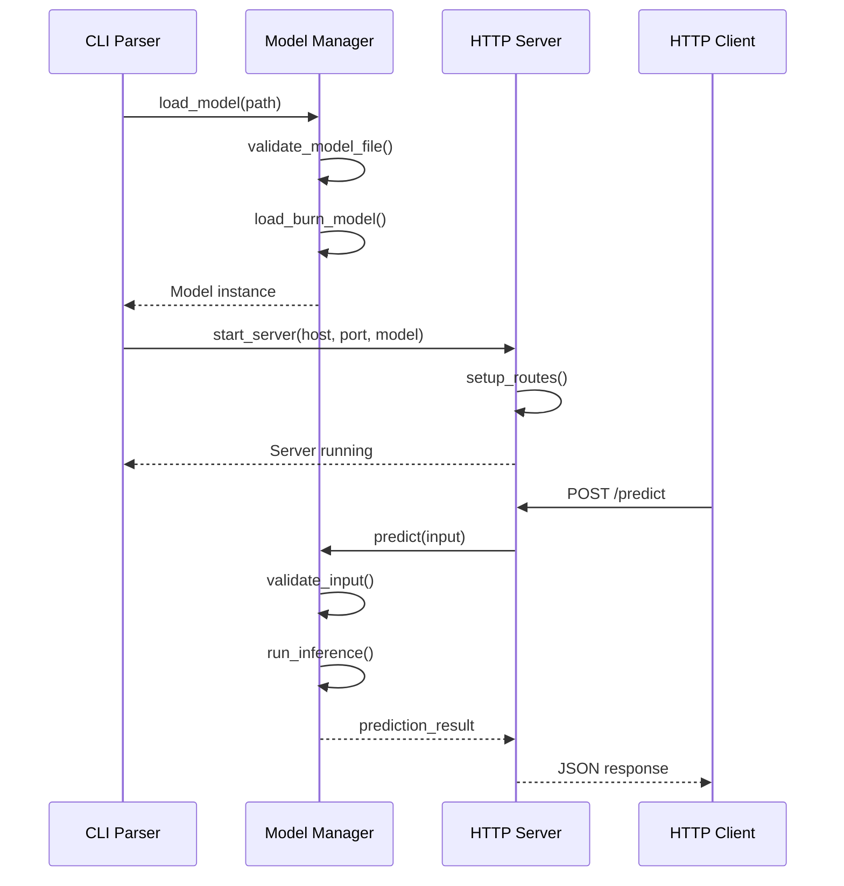

# Design Document

## Overview

The furnace inference server is designed as a lightweight, high-performance HTTP API server that loads and serves Burn-based machine learning models. The architecture follows a modular approach with clear separation between CLI handling, model management, and HTTP API layers.

The system uses Rust's async/await capabilities with Tokio runtime for concurrent request handling, Axum for HTTP routing, and Burn framework for model operations. The design prioritizes performance through advanced Burn optimizations (kernel fusion, autotuning cache), backend flexibility (CPU/GPU), concurrency control with backpressure, and optimized I/O processing.

Key design principles:
- Single binary deployment with no external dependencies
- Comprehensive error handling with structured responses
- Advanced Burn framework integration for optimal performance
- Flexible backend support (CPU, WGPU, Metal, CUDA)
- Production-ready features including CORS, logging, and health checks

## Architecture

### High-Level Architecture

```
┌─────────────────┐    ┌─────────────────┐    ┌─────────────────┐
│   CLI Layer     │───▶│  Model Layer    │───▶│   API Layer     │
│                 │    │                 │    │                 │
│ - Argument      │    │ - Model Loading │    │ - HTTP Routes   │
│   Parsing       │    │ - Inference     │    │ - Request       │
│ - Validation    │    │ - Metadata      │    │   Handling      │
│ - Logging Setup │    │ - Error Handling│    │ - Response      │
└─────────────────┘    └─────────────────┘    └─────────────────┘
```

### Component Interaction Flow



## Components and Interfaces

### 1. CLI Component (`main.rs`)

**Responsibilities:**
- Parse command-line arguments using clap
- Initialize logging with tracing
- Coordinate model loading and server startup
- Handle startup errors gracefully
- Configure backend selection and optimization settings

**Key Interfaces:**
```rust
struct CliArgs {
    model_path: PathBuf,
    host: String,
    port: u16,
    backend: Option<String>,
    max_concurrent_requests: Option<usize>,
    enable_kernel_fusion: bool,
    enable_autotuning: bool,
}

async fn main() -> Result<(), Box<dyn std::error::Error>>
```

### 2. Model Management Component (`model.rs`)

**Responsibilities:**
- Load and validate .mpk and .onnx model files
- Provide model metadata and inference capabilities
- Handle model-specific errors and validation
- Manage model state and lifecycle

**Key Interfaces:**
```rust
pub struct Model {
    inner: Box<dyn BurnModel>,
    info: ModelInfo,
    path: PathBuf,
}

pub struct ModelInfo {
    pub name: String,
    pub input_shape: Vec<usize>,
    pub output_shape: Vec<usize>,
    pub model_type: String,
    pub backend: String,
}

pub trait BurnModel: Send + Sync {
    async fn predict(&self, input: Tensor) -> Result<Tensor, ModelError>;
    fn get_input_shape(&self) -> &[usize];
    fn get_output_shape(&self) -> &[usize];
}

pub async fn load_model(path: &PathBuf) -> Result<Model, ModelError>
```

### 3. HTTP API Component (`api.rs`)

**Responsibilities:**
- Define HTTP routes and handlers
- Handle request/response serialization
- Implement CORS and middleware
- Provide error responses and status codes

**Key Interfaces:**
```rust
#[derive(Deserialize)]
pub struct PredictRequest {
    pub input: Vec<f32>,
    pub batch_size: Option<usize>,
}

#[derive(Serialize)]
pub struct PredictResponse {
    pub output: Vec<f32>,
    pub status: String,
    pub inference_time_ms: f64,
}

#[derive(Serialize)]
pub struct HealthResponse {
    pub status: String,
    pub model_loaded: bool,
    pub uptime_seconds: u64,
}

pub async fn start_server(host: &str, port: u16, model: Model) -> Result<(), ServerError>
```

## Data Models

### Request/Response Models

```rust
// Input validation and transformation
#[derive(Debug, Deserialize)]
pub struct PredictRequest {
    pub input: Vec<f32>,
    #[serde(default)]
    pub reshape: Option<Vec<usize>>,
}

// Standardized API responses
#[derive(Debug, Serialize)]
pub struct ApiResponse<T> {
    pub data: Option<T>,
    pub status: String,
    pub message: Option<String>,
    pub timestamp: String,
}

// Error response format
#[derive(Debug, Serialize)]
pub struct ErrorResponse {
    pub error: String,
    pub code: String,
    pub details: Option<serde_json::Value>,
}
```

### Model Representation

```rust
// Internal model state
pub struct LoadedModel {
    pub burn_model: Box<dyn BurnModel>,
    pub metadata: ModelMetadata,
    pub config: ModelConfig,
    pub stats: ModelStats,
}

#[derive(Debug, Clone, Serialize)]
pub struct ModelMetadata {
    pub name: String,
    pub version: String,
    pub input_spec: TensorSpec,
    pub output_spec: TensorSpec,
    pub created_at: String,
    pub model_size_bytes: u64,
}

#[derive(Debug, Clone, Serialize)]
pub struct TensorSpec {
    pub shape: Vec<usize>,
    pub dtype: String,
    pub min_value: Option<f32>,
    pub max_value: Option<f32>,
}
```

## Error Handling

### Error Types Hierarchy

```rust
#[derive(Debug, thiserror::Error)]
pub enum FurnaceError {
    #[error("Model error: {0}")]
    Model(#[from] ModelError),
    
    #[error("API error: {0}")]
    Api(#[from] ApiError),
    
    #[error("CLI error: {0}")]
    Cli(#[from] CliError),
}

#[derive(Debug, thiserror::Error)]
pub enum ModelError {
    #[error("Failed to load model from {path}: {source}")]
    LoadFailed { path: PathBuf, source: Box<dyn std::error::Error> },
    
    #[error("Invalid model format: {0}")]
    InvalidFormat(String),
    
    #[error("Inference failed: {0}")]
    InferenceFailed(String),
    
    #[error("Input validation failed: expected shape {expected:?}, got {actual:?}")]
    InputValidation { expected: Vec<usize>, actual: Vec<usize> },
}

#[derive(Debug, thiserror::Error)]
pub enum ApiError {
    #[error("Invalid request format: {0}")]
    InvalidRequest(String),
    
    #[error("Server startup failed: {0}")]
    ServerStartup(String),
}
```

### Error Response Strategy

1. **Client Errors (4xx)**: Input validation, malformed requests
2. **Server Errors (5xx)**: Model inference failures, internal errors
3. **Structured Error Responses**: Consistent JSON format with error codes
4. **Logging**: All errors logged with appropriate levels and context

## Testing Strategy

### Unit Testing

```rust
// Model component tests
#[cfg(test)]
mod model_tests {
    #[tokio::test]
    async fn test_model_loading_success() { /* ... */ }
    
    #[tokio::test]
    async fn test_model_loading_invalid_path() { /* ... */ }
    
    #[tokio::test]
    async fn test_inference_with_valid_input() { /* ... */ }
    
    #[tokio::test]
    async fn test_inference_with_invalid_shape() { /* ... */ }
}

// API component tests
#[cfg(test)]
mod api_tests {
    #[tokio::test]
    async fn test_predict_endpoint_success() { /* ... */ }
    
    #[tokio::test]
    async fn test_health_check_endpoint() { /* ... */ }
    
    #[tokio::test]
    async fn test_model_info_endpoint() { /* ... */ }
    
    #[tokio::test]
    async fn test_cors_headers() { /* ... */ }
}
```

### Integration Testing

```rust
#[cfg(test)]
mod integration_tests {
    #[tokio::test]
    async fn test_end_to_end_inference() {
        // Load test model
        // Start server
        // Make HTTP requests
        // Verify responses
    }
    
    #[tokio::test]
    async fn test_server_startup_with_invalid_model() {
        // Test graceful error handling
    }
}
```

### Performance Testing

- **Load Testing**: Use tools like `wrk` or `hey` to test concurrent requests
- **Memory Usage**: Monitor memory consumption during inference
- **Latency Benchmarks**: Measure p50, p95, p99 response times
- **Model Loading Time**: Benchmark model initialization performance

## Implementation Considerations

### Burn Framework Integration

1. **Model Loading**: Support both Burn's native .mpk format and ONNX files through Burn's ONNX integration
2. **Backend Selection**: Support CPU and potentially GPU backends
3. **Tensor Operations**: Leverage Burn's tensor abstractions for input/output handling
4. **Memory Management**: Efficient tensor memory allocation and cleanup

### Burn Framework Advanced Features

1. **Kernel Fusion**: Enable fusion of operations like GELU and MatMul to reduce memory copy overhead and GPU kernel launch overhead
2. **Autotuning Cache**: Utilize Burn's autotuning capabilities to cache optimal kernel configurations for different matrix sizes
3. **Backend Selection**: Support multiple backends (CPU, WGPU, Metal, CUDA) with automatic fallback mechanisms
4. **Async Execution**: Leverage Burn's async backend capabilities for non-blocking inference operations

### Performance Optimizations

1. **SIMD JSON Processing**: Use simd-json for high-performance JSON parsing and serialization
2. **Zero-Copy Operations**: Implement zero-copy serialization using bytes::Bytes for efficient memory usage
3. **Concurrency Control**: Implement semaphore-based request limiting with backpressure handling
4. **Memory Mapping**: Consider memory-mapped model loading for large models
5. **Connection Pooling**: Reuse HTTP connections where possible
6. **Streaming Processing**: Support streaming JSON for large payloads

### Security Considerations

1. **Input Validation**: Strict validation of all input data
2. **Resource Limits**: Prevent excessive memory usage from large inputs
3. **Error Information**: Avoid leaking sensitive information in error messages
4. **CORS Configuration**: Properly configured cross-origin policies

### Deployment Considerations

1. **Single Binary**: Self-contained executable with no external dependencies
2. **Configuration**: Environment variable support for production deployments
3. **Health Checks**: Comprehensive health monitoring endpoints
4. **Graceful Shutdown**: Proper cleanup on SIGTERM/SIGINT signals